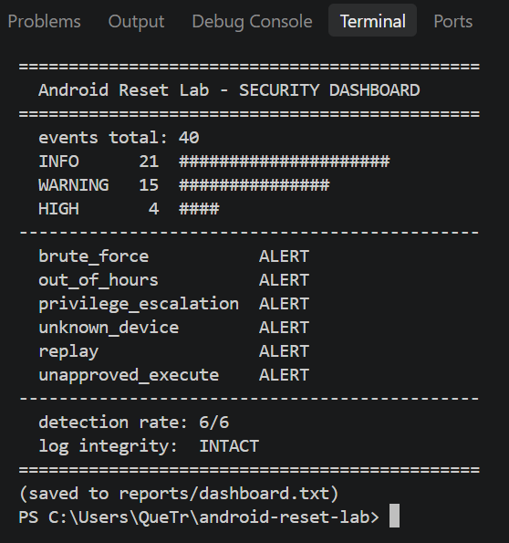

# Android Reset Lab

A safe, fully simulated cybersecurity lab demonstrating how a device-management system can protect sensitive factory-reset operations through authentication, authorization, dual control, attack detection, and tamper-evident auditing.

**Safety boundary:** Nothing in this project touches a real device, account, file, or external network. All device resets are simulated.




## What This Project Demonstrates

- **Authentication** - salted PBKDF2 password hashing with constant-time compare, session tokens, session expiration, account lockout with generic messages to prevent enumeration
- **Authorization** - role-based access control (RBAC) with default-deny enforcement and role whitelist
- **Dual control** - reset requests require approval from a second authorized user (four-eyes)
- **Simulation guard** - reset operations cannot affect real devices
- **Audit logging** - hash-chained JSON Lines logs with integrity verification and timestamp spoofing protection
- **Threat detection** - six simulated attack scenarios with measurable detection results
- **Security testing** - automated tests verify safety and workflow controls
- **Reporting** - detection metrics and security analysis

## Security Workflow

```
User authentication
       |
       v
Session token (128-bit, TTL 30m)
       |
       v
Role authorization (default-deny)
       |
       v
Reset request (unique ID, device validation)
       |
       v
Second-person approval (requester != approver)
       |
       v
SIMULATED execution (status field only)
       |
       v
Hash-chained audit log
       |
       v
Threat detection
       |
       v
Security reporting
```

## Attack Simulation Results

The included `attacker_sim.py` generates six controlled attack scenarios against the simulated environment. No real exploitation is performed.

| Attack Scenario | Detection Rule | Result |
|-----------------|----------------|--------|
| Brute force | Repeated LOGIN_FAILED events | Detected |
| Out-of-hours reset | Reset outside allowed hours | Detected |
| Privilege escalation | ACCESS_DENIED events | Detected |
| Unknown device | Device not present in fleet | Detected |
| Replay | Duplicate request ID | Detected |
| Unapproved execution | RESET_BLOCKED simulation guard | Detected |

**Latest Verified Result:** Detection rate: 6/6 (100%) — This represents the six labelled scenarios included in the laboratory. It is not a claim of real-world detection coverage.

## Access-Control Model

| Role | Request Reset | Approve Reset | Manage Users | View Logs |
|------|---------------|---------------|--------------|-----------|
| Viewer | No | No | No | No |
| Operator | Yes | No | No | No |
| Admin | Yes | Yes | Yes | No |
| Security Analyst | No | No | No | Yes |

The reset workflow follows separation of duties: the person requesting a reset cannot approve their own request.

## Tamper-Evident Audit Logging

The security logger maintains a hash-chained JSON Lines audit log.

Each event contains:
- `prev_hash` - hash of the previous event
- `entry_hash` - SHA-256 hash of the current event
- Timestamp, Event type, Severity, Actor, Device ID, Request ID, Outcome

If an existing event is modified, the calculated hash no longer matches the stored hash and the chain-integrity check detects the modification.

This is an educational tamper-evident mechanism and should not be considered equivalent to cryptographic signing, immutable enterprise logging, or a production SIEM.

## Red-Team / Blue-Team Design

**Red Team** `attacker_sim.py` generates controlled scenarios representing:
- Brute-force authentication attempts
- Out-of-hours reset activity
- Privilege escalation
- Requests against unknown devices
- Replay of a reset request
- Attempted execution without approval

**Blue Team** `threat_detection.py` analyzes the audit log and identifies the corresponding indicators.

## Simulated Android Fleet

`device_simulator.py` contains a fictional device inventory.

Example devices: AND-001 - Pixel 7, AND-003 - Pixel 6a, AND-006 - Galaxy A54

These are simulated records only. The project does not:
- Connect to Android devices
- Use ADB
- Execute factory-reset commands
- Modify real device storage
- Communicate with real device-management services

A simulated reset only changes the status of a fictional device record.

## Safety Model

Safety is a core design requirement.

The project uses:
```python
SIMULATION_MODE = True
```

The laboratory also includes automated safety tests that inspect Python source code for prohibited destructive operations.

The project deliberately avoids:
- Real device wiping
- Real factory-reset commands
- ADB-based device control
- Shell execution
- Destructive filesystem operations
- External device-management APIs

## Automated Testing

The project includes automated tests covering:
- Authentication (password rejection with generic messages, lockout, constant-time compare)
- Session creation, expiration, invalidation
- RBAC permissions, default-deny
- Reset approval, four-eyes enforcement, correct audit actor logging
- Unknown-device rejection, operator restrictions
- Simulated reset execution
- Audit-log integrity
- Safety controls

Current verified result: **20 passed**

Run the tests with:
```bash
pip install -r requirements.txt
python -m pytest tests -q
```

## Project Structure

```
android-reset-lab/
|-- authentication.py       # Password hashing and authentication (PBKDF2 + hmac.compare_digest)
|-- authorization.py        # Role-based access control
|-- seed_lab.py             # Centralized simulation seeding (env var override)
|-- approve_helper.py       # Approval workflow helpers (getpass)
|-- attacker_sim.py         # Controlled attack simulation
|-- config.py               # Lab configuration
|-- device_simulator.py     # Simulated device operations
|-- reset_workflow.py       # Reset request/approval workflow (fixed actor logging)
|-- security_logger.py      # Hash-chained audit logging (timestamp spoof protection)
|-- threat_detection.py     # Attack detection rules
|-- reports.py              # Security metrics and reports
|-- web_console.py          # Local demonstration console (XSS fixed)
|-- tests/
|   |-- conftest.py         # Test-state isolation
|   |-- test_safety.py      # Safety controls
|   `-- test_workflow.py    # Workflow and security tests
|-- .github/workflows/tests.yml
|-- dashboard.png           # Dashboard screenshot (renamed, no spaces)
|-- SECURITY.md             # Security scope and safety boundary
|-- THREAT_MODEL.md         # Threat model
|-- INTERVIEW_PREP.md       # Project discussion/interview notes
|-- requirements.txt
|-- LICENSE
```

Generated local files such as data/, logs/, reports/, scratch/, Python caches, and pytest caches are intentionally excluded from version control. Large video demos are excluded via .gitignore — upload to releases or external link.

## Quick Start

Install dependencies:
```bash
pip install -r requirements.txt
```

Seed the lab (uses env vars if set, otherwise simulation defaults):
```bash
python seed_lab.py
# Or set: LAB_ADMIN_PASS, LAB_OPS_PASS, LAB_ANALYST_PASS
```

Run the simulated attack scenarios:
```bash
python attacker_sim.py
```

Run threat detection:
```bash
python threat_detection.py
```

Generate reports:
```bash
python reports.py
```

Run the automated tests:
```bash
python -m pytest tests -q
```

Start the local demonstration console:
```bash
python web_console.py
```
Then open: http://127.0.0.1:8000

The console is local-only and operates against the simulated environment.

## Security Concepts Demonstrated

- Python security engineering
- Authentication, Password hashing (PBKDF2 100k + salt + constant-time), Session security
- Role-Based Access Control, Least privilege, Separation of duties
- Security logging, Hash chaining, Timestamp spoof protection
- Threat detection, Red-team simulation, Blue-team monitoring
- Automated security testing, Secure-by-design development
- User enumeration prevention, XSS prevention, Audit actor correctness

## Standards Mapping

Educational references, not claims of formal compliance.

| Feature | Security Concept | MITRE ATT&CK | NIST SP 800-53 |
|---------|------------------|--------------|----------------|
| Password hashing and lockout | Authentication controls | T1110 | IA-5, AC-7 |
| Session tokens | Authentication/session security | T1078 | IA-11 |
| RBAC | Least privilege | T1134 | AC-3, AC-6 |
| Dual control | Separation of duties | - | AC-5 |
| Hash-chained audit log | Audit protection | T1070 | AU-9 |
| Threat detection | Security monitoring | Various | SI-4 |
| Reporting | Audit review | - | AU-6 |
| Attack simulator | Security assessment exercise | - | CA-8 |
| Device inventory | Configuration management | - | CM-8 |

## Limitations

This project is intentionally a simulation, not an Android management product. It does not communicate with Android devices, execute real factory resets, modify real device storage, contact external services, perform real-world exploitation, or provide production-grade MDM functionality.

## Ethical and Safety Notice

This project is intended for authorized educational and defensive cybersecurity learning. All attack scenarios operate against a fictional local environment. No real device, account, or external system is targeted.

## Future Defensive Improvements

- MFA simulation
- Rate limiting on console
- Argon2 option
- SIEM integration simulation
- CSV/PDF security reports
- Expanded threat modelling
- Improved audit-log storage

The project should remain simulation-only.

## Recent Fixes (P0 Hardening)

- Fixed audit log actor bug: `execute_reset` now logs executor, not approver
- Fixed unknown device actor bug: logs actual actor, not "unknown"
- Fixed user enumeration: generic "invalid credentials" message
- Fixed timing attack: `hmac.compare_digest` for password hashes
- Fixed XSS in web console: HTML escaping + security headers
- Fixed password echo: `getpass` in approve helper
- Fixed reports crash: `makedirs` for reports folder
- Fixed timestamp spoofing: `_allow_custom_timestamp` flag
- Centralized seeding in `seed_lab.py` with env var override
- Removed large binaries from git (video), renamed screenshot to `dashboard.png`
- Added `requirements.txt`, `LICENSE`, proper CI workflow
- Fixed duplicate tests, added regression test for actor logging

## Portfolio Summary

Android Reset Lab demonstrates practical defensive cybersecurity engineering by combining authentication, RBAC, separation of duties, secure workflow design, tamper-evident auditing, attack simulation, threat detection, and automated security testing in a controlled environment.

Verified laboratory results: 20 automated tests passing and 6/6 simulated attack categories detected.
