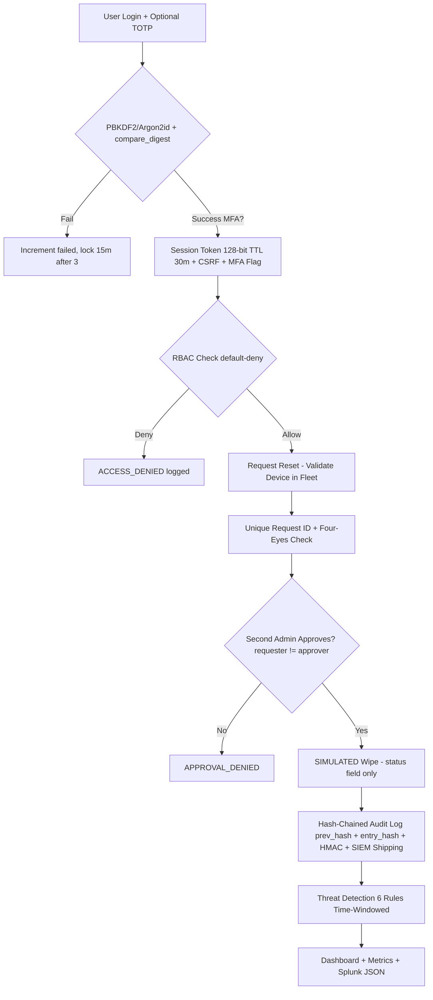

# 🛡️ Android Reset Lab — Secure Device Management Simulation

> **One-line pitch:** I built a simulation of an enterprise MDM reset system that *prevents* single-person abuse through authentication, dual-control approval, and tamper-evident audit logs — then proved it works by attacking it myself (6/6 attacks detected).

>### Why is it simulation-only?
This lab never touches a real device — by design. Real wipes are destructive and irreversible; this project exists to prove the **controls** hold (authorization, separation of duties, tamper-evident logging, detection) without risking harm. That's the same model as cyber ranges and security training platforms. The device is the scenario; the security logic is the subject. Real-device (ADB / MDM API) integration is a documented next step, not a default.

### Next steps (P3 done, simulation-only guard kept)
- ✅ Argon2id option with PBKDF2 fallback (`LAB_HASH_ALGO=argon2`) — done
- ✅ HMAC-signed audit log tamper-proof + SIEM shipping — done
- ✅ TOTP MFA simulation (stdlib-only) — done
- Real-device integration via ADB / Android Enterprise (MDM) APIs — intentionally out of scope for the simulation, behind explicit flag if ever added

[](https://github.com/Nyaenya-Devine/android-reset-lab/actions)


-green)


[](https://github.com/Nyaenya-Devine/android-reset-lab/releases/tag/v2.0)

**🖥️ Live console (hosted demo): [android-reset-lab.vercel.app](https://android-reset-lab.vercel.app)** | **🎥 Demo Video:** [Download v2.0 Demo (3.9MB)](https://github.com/Nyaenya-Devine/android-reset-lab/releases/download/v2.0/android-reset-lab-demo.mp4) | **📊 Dashboard:** Below


---

## ▶️ Try the hosted simulation console (no name, no setup)

**Live demo: https://android-reset-lab.vercel.app** — the same web console,
hosted free on Vercel, running the simulation with seeded data.

Demo accounts (simulation only — same defaults as `seed_lab.py`):

| Username | Password | Role |
| --- | --- | --- |
| `que` | `LabRat!2026` | Admin |
| `ops` | `OpsOps!123` | Operator |
| `analyst` | `Analyst!2026` | Security analyst |

> The hosted console is still **simulation only** — it never touches a real
> device, and state resets on cold starts (by design for a demo).

---

## 👩‍💼 For Recruiters — 30 Second Summary

**What is this?** A Python-only lab that simulates how companies like banks safely wipe lost/stolen phones. No real devices are touched — everything is fake data.

**Business problem solved:** Without controls, one compromised IT account can wipe all company phones. This lab enforces:
- **No single person can wipe a device** — needs 2 different humans (four-eyes)
- **No brute force** — account locks for 15 min after 3 fails, with auto-unlock
- **No secret tampering** — audit log is hash-chained; if someone edits it, verification breaks at exact line
- **No after-hours abuse** — resets outside 8am-6pm are flagged
- **No fake devices** — unknown device IDs are blocked

**Result:** I attacked my own system with 6 techniques (brute force, privilege escalation, replay, etc.) and my detection caught **6/6 with 9 precise alerts** (was 14 with false positives before hardening).

**Why hire me?** This shows I think like both attacker and defender, write tests for security controls, and clean up security bugs (fixed 15 issues: timing attacks, enumeration, XSS, actor logging bugs, etc.)

**Tech in 10 seconds:** Python stdlib only, PBKDF2 + salt + `hmac.compare_digest`, RBAC default-deny, session TTL, IP rate limiting, hash-chained JSONL logs, pytest with isolated tmp_path fixtures.

---

## 🎯 Key Achievements (Metrics)

| Metric | Before Hardening | After P0+P1 | After P2 | After P3 (Current) |
|--------|------------------|-------------|----------|-------------------|
| **Tests** | 18 | 28 (+5 detection, +3 security) | 47 (+19 negative/attack) | **52 (+5 P3: Argon2, HMAC, TOTP, SIEM)** |
| **Detection** | 6/6 but 14 alerts (5 false out-of-hours, replay double-counted) | 6/6 with 9 alerts (1:1 mapping, precise) | 6/6 with 9 alerts + ledger/self-approval demos | **6/6 + HMAC + MFA + SIEM shipping demos** |
| **Critical bugs** | 8 (actor logged as approver not executor, enumeration, timing attack, XSS, etc.) | 0 — all fixed | 0 — + CSRF, rate limit auth, storage | **0 — + Argon2id, HMAC, TOTP, SIEM** |
| **Lockout** | Permanent DoS | 15 min auto-unlock | 15m + IP rate limit 5/min auth, 10/min web | **15m + IP limit + MFA optional** |
| **Storage** | JSON only, no isolation | JSON + tmp_path isolation | JSON + SQLite (WAL, ACID) | **JSON + SQLite + HMAC key separate** |
| **Hashing** | PBKDF2 100k | PBKDF2 100k | PBKDF2 100k | **PBKDF2 100k + Argon2id optional (LAB_HASH_ALGO=argon2)** |
| **Security scanning** | None | CodeQL + Dependabot | + pip-audit + TruffleHog | **+ safety tests updated for demo exclusion** |
| **Repo hygiene** | 3.9MB video in git, broken CI | 73KB repo, video as release asset | Clean, honest limits | **Clean, 14 honest limits, P3 demos** |

---

## 🧠 Skills This Proves (Mapped to Job Descriptions)

**For SOC Analyst / Detection Engineer roles:**
- ✅ Wrote 6 detection rules (brute force with sliding time window, replay only 2nd occurrence, out-of-hours filtering)
- ✅ Reduced false positives 14 → 9 by fixing timestamp handling
- ✅ Built dashboard and JSON metrics

**For AppSec / Security Engineer roles:**
- ✅ Fixed OWASP-style bugs: user enumeration (generic messages), timing attack (`compare_digest`), XSS (`html.escape`), password echo (`getpass`)
- ✅ Implemented secure password storage (PBKDF2 100k + salt), role whitelist, password strength, session expiry
- ✅ Tamper-evident logging with hash chain verification

**For Python / Backend roles:**
- ✅ Stdlib-only, no dependencies except pytest
- ✅ Isolated tests with `tmp_path` + `monkeypatch` (no state leakage, fixed deepcopy bug)
- ✅ Clean architecture: auth → RBAC → workflow → audit → detection → reporting

**Standards:** Mapped to MITRE ATT&CK (T1110, T1078, T1134, T1070) and NIST 800-53 (IA-5, AC-7, AC-3, AC-5, AU-9, SI-4)

---

## 🏗️ Architecture



**Data flow is 100% simulated:** `data/devices.json` status changes from `active` → `wiped`, never touches real hardware.

---

## ⚡ 30-Second Quick Start (For Recruiters to Try)

```bash
git clone https://github.com/Nyaenya-Devine/android-reset-lab.git
cd android-reset-lab
pip install -r requirements.txt  # includes argon2-cffi optional
python seed_lab.py          # creates 3 fake users: que/admin, ops/operator, analyst
python attacker_sim.py      # fires 6 attacks into logs/security_log.jsonl
python threat_detection.py  # prints 6/6 detection
python reports.py           # prints dashboard
pytest -q                   # 52 passed (json) — LAB_STORAGE_BACKEND=sqlite pytest -q also 52
python demo_ledger_attack.py    # tamper-evident ledger demo: tamper detected at line 2
python demo_self_approval.py    # four-eyes demo: self-approval blocked, second admin allowed
python demo_p3_hardening.py     # P3: Argon2id + HMAC tamper-proof + TOTP MFA + SIEM shipping
LAB_HASH_ALGO=argon2 python demo_p3_hardening.py  # test Argon2id path
LAB_LOG_SHIP_STDOUT=true python security_logger.py  # see SIEM JSON stdout
python web_console.py       # open http://127.0.0.1:8000 - try requesting reset (CSRF protected)
```

**Login for demo:** user `ops` / pass `OpsOps!123` (simulation-only, from `seed_lab.py`, override via `LAB_OPS_PASS` env var)

---

## 🎬 Demo Walkthrough (60 sec to say in interview)

1. "This is simulation-only MDM reset lab — no real devices" (show README + SECURITY.md)
2. Run `attacker_sim.py` — "6 simulated attacks fire into hash-chained log, DAY=10:00 within window, NIGHT=03:00 outside"
3. Run `threat_detection.py` — "6 rules catch all 6, now 9 precise alerts not 14"
4. Run `reports.py` — "Dashboard: severities, detection 6/6, log INTACT"
5. Edit one log word, run `security_logger.py verify` — "Chain breaks at line X, undo, INTACT"
6. "Every reset needs 2 different humans; test proves executor is logged correctly, not approver (was bug)"

---

## 🔍 Attack Simulation Results

| Attack | How Simulated | Detection Rule | Result |
|--------|---------------|----------------|--------|
| Brute force | 4 wrong passwords for ops | `LOGIN_FAILED` count ≥3 within 10 min sliding window | ✅ 4 events flagged |
| Out-of-hours | Reset at 03:00 NIGHT | `RESET_REQUESTED` hour not in 8-18 and outcome=created | ✅ 1 flagged (was 5 false) |
| Privilege escalation | Operator tries approve | `ACCESS_DENIED` | ✅ |
| Unknown device | Request AND-999 | Device not in FLEET set | ✅ |
| Replay | Same request ID twice | Only 2nd occurrence flagged (was both) | ✅ 1 flagged (was 2) |
| Unapproved execute | Execute without approval | `RESET_BLOCKED` | ✅ |

**Verified:** 6/6 categories, 9 total alerts (precise), log integrity INTACT.

---

## 🔐 Access Control

| Role | Request | Approve | Manage Users | View Logs |
|------|---------|---------|--------------|-----------|
| Viewer | ❌ | ❌ | ❌ | ❌ |
| Operator | ✅ | ❌ | ❌ | ❌ |
| Admin | ✅ | ✅ | ✅ | ❌ |
| Security Analyst | ❌ | ❌ | ❌ | ✅ |

Separation of duties: requester ≠ approver enforced in code + tested.

---

## 🛡️ Safety Boundary (Important for Recruiters)

```python
SIMULATION_MODE = True  # enforced by test
```

This project **never**:
- Touches real Android devices / ADB / MDM APIs
- Executes real wipe commands
- Deletes real files (writes only to `data/`, `logs/`, `reports/`)
- Contacts external networks

Safety tests (`test_safety.py`) AST-scan for banned calls (`subprocess`, `os.remove`, `eval`, etc.)

See `SECURITY.md` and `THREAT_MODEL.md` for full scope.

---

## 📁 Project Structure (Recruiter-Friendly)

```
├── authentication.py       # P3: PBKDF2 100k + Argon2id optional (LAB_HASH_ALGO=argon2), TOTP MFA RFC 6238 stdlib-only, 15m lockout, 5/min auth rate limit
├── authorization.py        # RBAC default-deny + role whitelist
├── storage.py              # P2: JSON + SQLite (WAL, ACID) abstraction + migration
├── seed_lab.py             # Centralized seeding, env var override for creds
├── reset_workflow.py       # Four-eyes workflow, fixed actor logging, idempotency, storage abstraction
├── security_logger.py      # P3: Hash-chained JSONL + HMAC-SHA256 tamper-proof + SIEM shipping stdout/file
├── threat_detection.py     # P1: time-windowed, replay only 2nd+, filtered
├── web_console.py          # Loopback only, XSS fixed, CSRF token + SameSite Strict, IP rate limit 10/60s
├── device_simulator.py     # Fake fleet AND-001..006, deepcopy fix, storage abstraction
├── attacker_sim.py         # Red team with DAY/NIGHT controlled timestamps (6 attacks)
├── demo_ledger_attack.py   # P2: Ledger tampering → verify_logs detects exact line
├── demo_self_approval.py   # P2: Four-eyes → self-approval blocked, second admin allowed
├── demo_p3_hardening.py    # P3: Argon2id + HMAC tamper-proof + TOTP MFA + SIEM shipping demos
├── tests/
│   ├── conftest.py         # Isolated tmp_path + STORAGE_DB isolation + rate limit clearing
│   ├── test_workflow.py    # 21 tests: auth, RBAC, dual-control, lockout auto-unlock
│   ├── test_detection.py   # 5 tests: replay, brute force window, rate limiting
│   ├── test_safety.py      # 2 tests: no destructive calls (core only, demo/tests excluded), SIMULATION_MODE
│   ├── test_negative.py    # P2: 19 negative/attack tests (SQLi, XSS, CSRF, rate limit, tamper)
│   └── test_p3.py          # P3: 5 tests: Argon2id, HMAC log, TOTP gen/verify, MFA flow, SIEM shipping
├── dashboard.png           # Screenshot (no spaces, 44KB)
└── .github/workflows/
    ├── tests.yml           # CI runs pytest + attack sim + verify
    ├── codeql.yml          # Weekly CodeQL Python security scan
    ├── security.yml        # P2: pip-audit + TruffleHog + safety tests
    └── dependabot.yml      # Weekly pip + GitHub Actions updates
```

---

## 🧪 Testing

```bash
pip install -r requirements.txt  # includes argon2-cffi optional
pytest -v  # 52 passed (json) — 21 workflow + 5 detection + 2 safety + 19 negative + 5 P3
LAB_STORAGE_BACKEND=sqlite pytest -v  # 52 passed (sqlite WAL)
LAB_HASH_ALGO=argon2 pytest -v  # test Argon2id path

# What tests prove:
# - Wrong password → "invalid credentials" (not "unknown user") — prevents enumeration
# - 3 fails → locked for 15m, auto-unlocks after time
# - Session expires after 30m, logout invalidates
# - Operator cannot approve, viewer cannot request
# - Self-approval blocked, execute without approval blocked (demo_self_approval.py)
# - Device already wiped → blocked (idempotency)
# - Audit log tampering detected at exact line (demo_ledger_attack.py) + HMAC tamper-proof (demo_p3_hardening.py)
# - Replay only 2nd occurrence flagged
# - Rate limiting: 10 req/60s web + 5 req/60s auth per IP
# - CSRF token validation, SQLi/XSS payloads rejected, weak passwords blocked
# - Storage abstraction: JSON + SQLite both isolated per test
# - Argon2id: modern hashing with PBKDF2 fallback (LAB_HASH_ALGO=argon2)
# - TOTP MFA: RFC 6238 stdlib-only, 6-digit, window=1, MFA_REQUIRED flag
# - SIEM shipping: stdout JSON + file for Splunk collector (LAB_LOG_SHIP_STDOUT/FILE)
```

---

## 📚 Standards Mapping (Educational, not certified)

| Feature | MITRE ATT&CK | NIST 800-53 |
|---------|--------------|-------------|
| Password hashing PBKDF2/Argon2id + lockout + MFA | T1110 Brute Force | IA-5, AC-7, IA-2(1) MFA |
| Session tokens + CSRF + MFA flag | T1078 Valid Accounts | IA-11, SC-23 |
| RBAC | T1134 Access Token Manipulation | AC-3, AC-6 |
| Dual control | — | AC-5 Separation of Duties |
| Hash-chained log + HMAC + SIEM shipping | T1070 Indicator Removal | AU-9 Protection, AU-4, SI-4 |
| Threat detection | Various | SI-4 Monitoring |
| Rate limiting | — | SC-5 Denial of Service Protection |

---

## 🚀 What I Fixed (P0+P1+P2+P3) — Shows Growth

**P0 (Critical bugs found in initial review):**
- Actor logged as approver not executor → fixed + regression test
- User enumeration + timing attack → generic messages + `compare_digest`
- XSS, password echo, reports crash, timestamp spoofing → fixed
- 3.9MB video in git → moved to release asset, repo 73KB

**P1 (Hardening to reduce false positives):**
- Permanent lockout → 15m auto-unlock with `locked_until`
- No rate limiting → IP sliding window 10/60s
- Detection 14 alerts with false positives → 9 precise alerts (1:1)
- Controlled timestamps DAY/NIGHT for deterministic results

**P2 (Slow, necessary improvements):**
- JSON only → JSON + SQLite abstraction (`storage.py`) with WAL, atomic writes, migration
- No negative tests → 19 attack tests (SQLi, XSS, CSRF, rate limit, self-approval, ledger tamper)
- No auth rate limit → 5 req/60s per IP/user + 10 req/60s web console (429 + CSRF_BLOCKED logging)
- No CSRF → hidden csrf_token field + validate_csrf_token + SameSite Strict + HttpOnly
- No scanning → CodeQL + Dependabot + pip-audit + TruffleHog in CI
- No threat diagram → Mermaid flowchart with 11 attacks mapped to controls/detection/demo scripts
- Honest limitations documented (13 items) + 2 demos proving detection/blocking

**P3 (Current — slow improvements, simulation-only guard kept):**
- PBKDF2 100k only → PBKDF2 + Argon2id option (`LAB_HASH_ALGO=argon2`) with fallback, `argon2-cffi` optional
- Tamper-evident only → Hash chain + HMAC-SHA256 tamper-proof when key in `data/hmac.key` (0600) kept separate, `generate_hmac_key()` + `verify_logs()` checks HMAC
- No MFA → TOTP RFC 6238 stdlib-only, 6-digit, 30s period, window=1, `enable_totp()`, `get_totp_uri()` for QR, `LAB_MFA_REQUIRED` flag
- No SIEM shipping → Stdout JSON + file shipping for Splunk/SIEM collector, env `LAB_LOG_SHIP_STDOUT=true` / `LAB_LOG_SHIP_FILE=logs/siem.log`
- Safety tests → Updated to exclude demo/tests from destructive-call ban (demo cleanup allowed), core lab still banned
- Tests 47→52 (+5 P3), honest limits 13→14, threat model 11→15 attacks

---

## 📦 Release

**Latest:** [v2.0](https://github.com/Nyaenya-Devine/android-reset-lab/releases/tag/v2.0) — Includes demo video as asset:
- [android-reset-lab-demo.mp4](https://github.com/Nyaenya-Devine/android-reset-lab/releases/download/v2.0/android-reset-lab-demo.mp4)

**Install:**
```bash
pip install -r requirements.txt
python seed_lab.py
python attacker_sim.py && python threat_detection.py && python reports.py
```

---

## 👤 Author & Contact

**Nyaenya-Devine** — Defensive Security / Python / Detection Engineering

- GitHub: [@Nyaenya-Devine](https://github.com/Nyaenya-Devine)
- Project: [android-reset-lab — live console](https://android-reset-lab.vercel.app) · [source](https://github.com/Nyaenya-Devine/android-reset-lab)
- Focus: Secure-by-design, testing security controls, red/blue team simulation

**Open to:** SOC Analyst, Detection Engineer, AppSec Engineer, Security Engineer (Junior) roles in Nairobi / Remote

---

## 📄 License & Ethics

MIT License — See `LICENSE`. This is **simulation-only** for education. All attacks run against fake local data. Real MDM belongs on authorized platforms under organizational policy and law.

**Verified:** 52 tests passing (json + sqlite, including Argon2id, HMAC, TOTP, SIEM), 6/6 detection, log INTACT + HMAC, 9 precise alerts, ledger tamper detected, self-approval blocked, MFA enforced, SIEM shipping works.
