# THREAT_MODEL.md — P4 Cerberus God Mode

## Assets
- Audit log integrity (evidence) — hash-chained JSONL + optional HMAC-SHA256 + **Merkle transparency log RFC 6962/9162 with inclusion/consistency proofs + checkpoint anchoring (Rekor sim)**
- Authorization decisions — **Cedar ABAC policy-as-code with explicit deny, decision logs, bundle SHA, AuthZEN API + risk-adaptive step-up**
- Device records — AND-001..006 with **Play Integrity verdicts + StrongBox attestationSecurityLevel + trust_score**
- Session tokens — 128-bit TTL + CSRF + MFA verified + **DPoP proof-of-possession binding (jkt)**
- User credentials — PBKDF2 100k OR Argon2id + salt + constant-time + TOTP + **WebAuthn passkeys (phishing-resistant, AAGUID allowlist, counter clone detection)**
- Transaction integrity — **WYSIWYS HMAC-SHA256 + passkey tx confirmation extension**

## Simulated attackers
- Outsider guessing credentials (brute force) — rate limited + 15m lockout + TOTP + **passkey**
- Malicious insider operator tries approve — **Cedar policy forbid + four-eyes + risk 80 deny**
- Compromised admin bypass dual control — self-approval + **tx signing required for high risk**
- Log tamperer rewriting history — hash chain + HMAC + **Merkle inclusion proofs O(log N) + consistency proofs + checkpoint anchoring**
- Web attacker CSRF/XSS + phishing — CSRF token + CSP + **WebAuthn origin binding prevents phishing**
- Credential DB thief — Argon2id + **passkey private never leaves authenticator (simulated)**
- Device spoofer / emulator — **Play Integrity BASIC/DEVICE/STRONG + StrongBox Titan M + keybox.xml validation + trust_score**
- Token thief replaying bearer token — **DPoP binds token to key (jkt), proof requires private key, htm/htu binding**
- Transaction tamperer / confused deputy — **WYSIWYS transaction signing + explicit user confirmation**

## Threat Model Diagram (Mermaid) — P4

```mermaid
flowchart TD
    subgraph Assets
        A[Audit Log + HMAC + Merkle Transparency]
        B[AuthZ Cedar ABAC + Risk Adaptive + Decision Logs]
        C[Device Fleet + Play Integrity + StrongBox]
        D[Sessions + CSRF + MFA + DPoP jkt]
        E[User Creds PBKDF2/Argon2id + TOTP + Passkeys]
        F[Transactions WYSIWYS + Passkey Confirmation]
    end

    subgraph Attackers
        ATT1[Outsider Brute Force + Phishing]
        ATT2[Malicious Insider Operator]
        ATT3[Compromised Admin]
        ATT4[Log Tamperer]
        ATT5[Web Attacker CSRF/XSS/Phishing]
        ATT6[Credential DB Thief]
        ATT7[Device Spoofer Emulator/Rooted]
        ATT8[Token Thief Bearer Replay]
        ATT9[Transaction Tamperer]
    end

    subgraph Controls P4
        C1[PBKDF2/Argon2id + compare_digest + Passkey origin binding]
        C2[Lockout 15m + IP Rate Limit 5/min + TOTP + Passkey + Risk velocity/impossible travel]
        C3[Cedar ABAC Default-Deny + Explicit Deny + Role Whitelist + Bundle SHA]
        C4[Four-Eyes + State Machine + Risk step-up 30 + tx_signing 60 + deny 80]
        C5[Hash Chain + HMAC-SHA256 + Merkle Tree + Inclusion/Consistency Proofs + Checkpoint Rekor sim]
        C6[CSRF Token + SameSite Strict + HttpOnly + CSP + WebAuthn RP ID + Origin Validation]
        C7[XSS html.escape + CSP frame-ancestors none]
        C8[Rate Limiting 10 req/60s IP + Auth 5/min]
        C9[Inventory Validation + Attestation Security Level Software/TEE/StrongBox + Trust Score]
        C10[SIEM Shipping + Decision Logs + Merkle STH]
        C11[WYSIWYS HMAC + Passkey txAuthSimple + Display What You See Is What You Sign]
        C12[DPoP Proof JWT htm/htu/iat/jti + jkt Binding + Token cannot be used without proof]
        C13[Play Integrity MEETS_BASIC/DEVICE/STRONG + Keybox Valid + Patch Recent + Bootloader Locked]
        C14[WebAuthn AAGUID Allowlist via FIDO MDS + Counter Clone Detection]
    end

    subgraph Detection P4
        D1[brute_force: LOGIN_FAILED >=3 in 10m + risk failed_auth factor]
        D2[out_of_hours: RESET_REQUESTED outside 8-18 + time_anomaly factor]
        D3[privilege_escalation: ACCESS_DENIED + is_escalation factor 40]
        D4[unknown_device: device not in FLEET + attestation untrusted]
        D5[replay: duplicate request_id 2nd+ only]
        D6[unapproved_execute: RESET_BLOCKED + attestation re-check at execution]
        D7[verify_logs: hash recompute + HMAC verify + Merkle verify_all + inclusion proof]
        D8[CSRF_BLOCKED + RATE_LIMITED + MFA_FAILED + WEBAUTHN_FAILED]
        D9[SIEM: stdout JSON + file + decision_logs + checkpoints]
        D10[impossible_travel: geo change <10m 30 score]
        D11[velocity: >10/min 25 score, >20/min 40 score]
        D12[device_trust: compromised 50, emulator 40, rooted 35, unknown 15]
        D13[attestation: emulator, bootloader unlocked, patch old, keybox invalid → trust_score]
        D14[webauthn: counter <= stored → clone detection]
        D15[dpop: htm/htu mismatch, iat not fresh]
        D16[tx_signing: HMAC mismatch, expired >5m]
    end

    ATT1 --> C1 & C2 & C14 --> D1 & D8 & D10 & D11
    ATT2 --> C3 & C4 --> D3 & D6
    ATT3 --> C4 & C11 --> D6 & D16
    ATT4 --> C5 --> D7
    ATT5 --> C6 & C7 & C8 --> D8 & D14
    ATT6 --> C1 & C14 --> D7
    ATT7 --> C9 & C13 --> D4 & D12 & D13
    ATT8 --> C12 --> D15
    ATT9 --> C11 --> D16
    A --> C5 & C10 --> D7 & D9
    B --> C3 & C4 & C2
    C --> C9 & C13
    D --> C6 & C8 & C2 & C12
    E --> C1 & C2 & C14
    F --> C11
```



## Attacks modeled and controls — P4 Extended

| # | Attack | Control | Detection | Demo |
|---|---|---|---|---|
| 1 | Brute force login | Lockout 15m + IP 5/min + TOTP + passkey + risk failed_auth | brute_force + risk factor | `attacker_sim.py` + `risk_engine.py` |
| 2 | Out-of-hours reset | Policy window 8-18 + time_anomaly factor 10/20 | out_of_hours + time_anomaly | `attacker_sim.py` + `risk_engine.py` |
| 3 | Privilege escalation | RBAC default deny + Cedar explicit deny + role whitelist + is_escalation 40 | privilege_escalation | `attacker_sim.py` + `policy_engine.py` |
| 4 | Ghost device / compromised device | Inventory validation + deny_compromised_device policy + attestation untrusted block | unknown_device + attestation | `cerberus_workflow.py` + `attestation.py` |
| 5 | Replay request_id | Idempotency + uniqueness + Merkle consistency proof | replay | `attacker_sim.py` |
| 6 | Unapproved execute / continuous verification | State machine + attestation re-check at execution + risk deny 80 | unapproved_execute | `cerberus_workflow.py` |
| 7 | Log tampering evident | Hash chain prev_hash + entry_hash | verify_logs recompute | `demo_ledger_attack.py` |
| 8 | Log tampering proof | HMAC-SHA256 + Merkle inclusion O(log N) + STH signature | verify_logs HMAC + Merkle verify_all | `demo_p3_hardening.py` + `merkle_ledger.py` |
| 9 | Self-approval bypass | Four-eyes requester != approver + policy context.requester != approver | APPROVAL_DENIED | `demo_self_approval.py` + `policy_engine.py` |
| 10 | CSRF | CSRF token + SameSite Strict + HttpOnly | CSRF_BLOCKED | `web_console.py` |
| 11 | Rate limit bypass / velocity | IP sliding 10/60s + auth 5/60s + risk velocity factor | RATE_LIMITED + velocity | `web_console.py` + `risk_engine.py` |
| 12 | XSS + phishing | html.escape + CSP + WebAuthn origin binding + RP ID validation | prevented + origin mismatch | `web_console.py` + `webauthn_sim.py` |
| 13 | Password DB theft | Argon2id memory-hard + PBKDF2 fallback + passkey private never leaves authenticator | mitigated | `demo_p3_hardening.py` |
| 14 | MFA bypass / credential stuffing | TOTP + passkey phishing-resistant + risk mfa factor -10 for passkey | MFA_FAILED | `demo_p3_hardening.py` + `webauthn_sim.py` |
| 15 | Log loss / no transparency | SIEM shipping + decision logs + Merkle checkpoints Rekor sim | SIEM + checkpoints | `demo_p3_hardening.py` + `merkle_ledger.py` |
| 16 | Emulator / rooted device spoof | Play Integrity BASIC/DEVICE/STRONG + StrongBox vs Software + trust_score penalties | device_trust + attestation | `attestation.py` + `demo_p4_cerberus.py` |
| 17 | Token theft bearer replay | DPoP proof JWT htm/htu/iat/jti + jkt binding, token cannot be used without proof | dpop htm/htu mismatch, iat not fresh | `dpop.py` + `cerberus_workflow.py` |
| 18 | Transaction tampering / confused deputy | WYSIWYS HMAC + passkey txAuthSimple + explicit display confirmation + 5m expiry | tx_signing HMAC mismatch, expired | `tx_signing.py` + `cerberus_workflow.py` |
| 19 | Impossible travel | Geo velocity: location change <10m → 30 score | impossible_travel factor | `risk_engine.py` |
| 20 | High-risk without step-up | Policy deny_high_risk_without_step_up + risk requires_step_up 30 + requires_tx 60 + should_deny 80 | risk_score + policy forbid | `policy_engine.py` + `risk_engine.py` |
| 21 | Passkey clone | WebAuthn counter: stored counter vs received, if received <= stored → clone detection | counter mismatch | `webauthn_sim.py` |
| 22 | Policy bundle tampering | Policy SHA (SHA256 of policies truncated 16 hex) in decision log + version | policy_sha mismatch | `policy_engine.py` |
| 23 | Merkle history rewrite | Inclusion proof O(log N) + consistency proof old->new + checkpoint anchoring Rekor sim ID | verify_all + consistency_proof | `merkle_ledger.py` + `demo_p4_cerberus.py` |

## Known Limitations (Honest) — P4

1. **HMAC + Merkle file-based**: Hash chain tamper-evident, HMAC tamper-proof if key separate, Merkle provides efficient proofs but rebuild O(N log N) for simulation. Production needs incremental tree + KMS/HSM + WORM + real Rekor anchoring with signed checkpoints.

2. **Policy engine uses safe AST walk, not full Cedar**: Supports subset of Cedar (==, !=, <, >, <=, >=, in, and, or, not, attribute access). No for loops, no like, no containsAll. Production needs Cedar WASM or OPA bundle. `eval()` builtin avoided to pass safety test.

3. **Risk engine in-memory**: velocity, failed_auth, geo stores are per-process memory, not Redis, resets on restart. Factors are heuristic, not ML. No baseline learning.

4. **WebAuthn simulation**: Public key simulated via hash(secret), not real ECDSA/RSA. Private never leaves authenticator in real, but here secret stored hex in file for simulation. No real FIDO MDS fetch, attestation verification simulated via allowlist. Counter clone detection implemented.

5. **Attestation simulation**: Fleet inventory static, attestation signals (bootloader_locked, patch_level, keybox_valid) are static JSON, not real Android Keystore extension parsing. Play Integrity token verification requires Google server-side, simulated here. GrapheneOS fallback to hardware attestation directly is modeled.

6. **TX signing HMAC sim**: Real WYSIWYS would use authenticator private key signing transaction via FIDO txAuthSimple extension. Here HMAC-SHA256 with file key simulates. 5m expiry enforced.

7. **DPoP HMAC sim**: Real DPoP uses asymmetric key (ES256/RS256) and JWK. Here oct HMAC simulates. jkt computed as SHA256(JWK) hex, not JWK thumbprint per RFC 7638, but similar. Real verification would use public key.

8. **Cerberus workflow**: Still simulation-only, no real device wipe. Four-eyes, risk, policy, attestation, passkey, tx signing, DPoP combined, but all in one process. Production would have PDP/PEP split, SPIFFE/SPIRE workload identity.

9. **Storage JSON/SQLite**: No concurrent write locking beyond file/SQLite WAL. Production needs proper DB.

10. **No account recovery**: No recovery codes for passkeys, no email reset.

11. **No audit log encryption**: Logs plaintext.

12. **Device fleet static**: No dynamic MDM inventory.

## Out of scope (and why)

Real device exploits, FRP bypass, radio, ADB, actual MDM API calls: harmful/unlawful without authorization, destructive/irreversible. Lab teaches defensive side — controls, detection, proof — without harm. Real-device integration documented as next step, intentionally not default. P4 keeps simulation-only guard.

## Trust Boundary — P4

```
[Untrusted: Internet, User Input, Browser, Emulator, Rooted Device]
        |
        v
[Web Console: Rate limiting, Input validation, CSRF, XSS escaping, Origin + RP ID validation] — Loopback only
        |
        v
[Auth: PBKDF2/Argon2id + compare_digest + lockout + rate limit + TOTP + Passkey (phishing-resistant, AAGUID allowlist, counter)] — Server-side
        |
        v
[Risk: velocity, impossible travel, device trust, time anomaly, session age, escalation, failed auth, mfa strength] — 0-100 score → step-up/tx/deny
        |
        v
[Attestation: Play Integrity BASIC/DEVICE/STRONG + Key Attestation Software/TEE/StrongBox + trust_score] — Hardware-backed
        |
        v
[AuthZ: Cedar ABAC default-deny + explicit forbid + decision logs + bundle SHA + AuthZEN API] — Server-side PDP
        |
        v
[Workflow: Four-eyes, State machine, Inventory check, Continuous attestation, WYSIWYS tx signing, DPoP binding] — Server-side PEP
        |
        v
[Storage: JSON/SQLite + Audit Log: hash chain + HMAC + Merkle tree + inclusion/consistency proofs + checkpoint Rekor sim + decision_logs + SIEM shipping] — Trusted but verified, keys separate
```

All policy decisions server-side; web console presentation only. HMAC key, tx signing key, Merkle root must be kept separate from log for tamper-proof. DPoP private never leaves client.

## Formal Spec (Informal TLA+)

- Merkle: ∀ i, ∃ P_i: verify_inclusion(leaf_hash_i, i, P_i, root) = true iff leaf_hash_i ∈ tree. Consistency: old_root prefix of new_root iff consistency_proof verifies.
- Policy: allow iff ∃ permit matching ∧ ∄ forbid matching. Fail-closed on eval error. Bundle SHA in log.
- Risk: risk_score = Σ factors 0-100 monotonic. Action_required = f(risk) thresholds 30,60,80.
- Attestation: trusted iff meets_strong ∧ verified iff keybox_valid ∧ ¬emulator. Trust_score penalizes unlocked, old patch, rooted, emulator.
- WebAuthn: registration ok iff challenge fresh ∧ origin allowed ∧ AAGUID allowed. Auth ok iff challenge fresh ∧ origin+RP match ∧ cred exists ∧ counter > stored.
- TX: verify ok iff HMAC(payload,key)==sig ∧ now-ts <5m.
- DPoP: verify ok iff typ==dpop+jwt ∧ htm/htu match ∧ iat fresh ∧ pub present.
- Cerberus: request ok iff authz ∧ device_exists ∧ attestation≠untrusted ∧ risk<80 ∧ policy_allow ∧ DPoP_ok. Approve ok iff exists ∧ requested ∧ four_eyes ∧ risk<80 ∧ step_up_if_needed ∧ tx_if_needed ∧ webauthn_if_needed ∧ policy_allow. Execute ok iff approved ∧ device_exists ∧ ¬wiped ∧ attestation_at_exec≠untrusted ∧ tx_still_valid.
