# THREAT_MODEL.md

## Assets
- Audit log integrity (evidence) — hash-chained JSONL
- Authorization decisions (who may reset) — RBAC + dual-control
- Device records (fleet inventory) — AND-001..006
- Session tokens — 128-bit with TTL + CSRF protection
- User credentials — PBKDF2 + salt + constant-time compare

## Simulated attackers
- Outsider guessing credentials (brute force) — rate limited + 15m lockout
- Malicious insider with valid low-privilege session (operator tries approve)
- Compromised admin trying to bypass dual control (self-approval)
- Actor with log write access trying to rewrite history (ledger tampering)
- Web attacker attempting CSRF / XSS against console

## Threat Model Diagram (Mermaid)

```mermaid
flowchart TD
    subgraph Assets
        A[Audit Log Integrity]
        B[AuthZ Decisions]
        C[Device Fleet]
        D[Sessions + CSRF]
        E[User Creds]
    end

    subgraph Attackers
        ATT1[Outsider Brute Force]
        ATT2[Malicious Insider Operator]
        ATT3[Compromised Admin]
        ATT4[Log Tamperer]
        ATT5[Web Attacker CSRF/XSS]
    end

    subgraph Controls
        C1[PBKDF2 + Salt + compare_digest]
        C2[Time-based Lockout 15m + IP Rate Limit 5/min]
        C3[RBAC Default-Deny + Role Whitelist]
        C4[Four-Eyes: requester != approver]
        C5[State Machine: requested -> approved -> executed]
        C6[Hash Chain prev_hash + entry_hash]
        C7[CSRF Token + SameSite Strict + HttpOnly]
        C8[XSS Protection html.escape + CSP]
        C9[Rate Limiting 10 req/60s IP]
        C10[Inventory Validation]
    end

    subgraph Detection
        D1[brute_force: LOGIN_FAILED >=3 in 10m window]
        D2[out_of_hours: RESET_REQUESTED outside 8-18]
        D3[privilege_escalation: ACCESS_DENIED]
        D4[unknown_device: device not in FLEET]
        D5[replay: duplicate request_id 2nd+ only]
        D6[unapproved_execute: RESET_BLOCKED]
        D7[verify_logs: hash recompute]
        D8[CSRF_BLOCKED + RATE_LIMITED]
    end

    ATT1 --> C1 & C2 --> D1
    ATT2 --> C3 --> D3
    ATT3 --> C4 & C5 --> D6
    ATT4 --> C6 --> D7
    ATT5 --> C7 & C8 & C9 --> D8
    ATT2 & ATT3 --> C10 --> D4
    ATT3 --> C5 --> D5

    A --> C6 & D7
    B --> C3 & C4 & C5
    C --> C10
    D --> C7 & C9
    E --> C1 & C2
```



## Attacks modeled and controls

| # | Attack | Control | Detection | Demo Script |
|---|---|---|---|---|
| 1 | Brute force login | Lockout 15m + IP rate limit 5/min (AC-7) | brute_force rule (sliding 10m window) | `attacker_sim.py:attack_brute_force` |
| 2 | Out-of-hours reset | Policy window 8-18 in config | out_of_hours rule (filters denied) | `attacker_sim.py:attack_out_of_hours` |
| 3 | Privilege escalation | RBAC default deny + role whitelist | privilege_escalation rule | `attacker_sim.py:attack_privilege_escalation` |
| 4 | Ghost device request | Inventory validation vs FLEET | unknown_device rule | `attacker_sim.py:attack_unknown_device` |
| 5 | Replay of request id | Idempotency + uniqueness check | replay rule (only 2nd+ flagged) | `attacker_sim.py:attack_replay` |
| 6 | Unapproved execute | State machine guard requested→approved→executed | unapproved_execute rule | `attacker_sim.py:attack_unapproved_execute` |
| 7 | Log tampering | Hash chain prev_hash + entry_hash | verify_logs() recompute | `demo_ledger_attack.py` |
| 8 | Self-approval bypass | Four-eyes: requester != approver | APPROVAL_DENIED logged | `demo_self_approval.py` |
| 9 | CSRF | CSRF token + SameSite Strict + HttpOnly | CSRF_BLOCKED | `web_console.py` (hidden field) |
| 10 | Rate limit bypass | IP sliding window 10 req/60s + auth 5 req/60s | RATE_LIMITED | `web_console.py` + `authentication.py` |
| 11 | XSS | html.escape + CSP frame-ancestors none | — (prevented) | `web_console.py` |

## Known Limitations (Honest)

**This is a simulation, not production MDM. Documented honestly:**

1. **No real crypto signing:** Hash chain is tamper-evident, not tamper-proof. Real SIEM needs HMAC with secret key or asymmetric signing. Our chain detects modification but doesn't prevent deletion of entire log.

2. **JSON/SQLite storage:** No concurrent write locking beyond simple file locks / SQLite WAL. Production needs proper DB with row-level locking.

3. **In-memory rate limiting:** `rate_limit_store` is per-process memory, resets on restart, not shared across workers. Production needs Redis.

4. **No MFA:** Only password + session token. No TOTP, WebAuthn, or device attestation.

5. **Session storage in JSON/SQLite:** Tokens stored in plaintext file, not HttpOnly Secure cookies with rotation (web console does use HttpOnly cookies, but API tokens are bearer).

6. **No password breach check:** No HaveIBeenPwned k-anonymity check.

7. **Detection is rule-based, not ML:** 6 rules with 100% on labelled data, but would have false positives/negatives in real world. No baseline learning.

8. **No log shipping:** Logs stay local, not shipped to SIEM/Splunk. No retention policy.

9. **PBKDF2 100k iterations:** OK for education, but modern recommendation is 310k+ or Argon2id. We have Argon2 as documented next step.

10. **CSRF token per session, not per form:** Token is per session, not rotated per request. Double-submit pattern would be stronger.

11. **No audit log encryption:** Logs contain actor, device_id in plaintext. Production needs field-level encryption for PII.

12. **Device fleet is static:** No dynamic inventory from real MDM, no ownership verification.

## Out of scope (and why)

Real device exploits, FRP bypass, radio attacks, ADB shell, actual MDM API calls: harmful and unlawful without authorization, destructive and irreversible. This lab teaches the defensive side instead — controls, detection, and proof — without risking harm. Real-device integration is documented as next step in README, intentionally not default.

## Trust Boundary

```
[Untrusted: Internet, User Input, Browser]
        |
        v
[Web Console: Rate limiting, Input validation, CSRF, XSS escaping] — Loopback only
        |
        v
[Auth: PBKDF2 + compare_digest + lockout + rate limit] — Server-side policy
        |
        v
[AuthZ: RBAC default-deny] — Server-side
        |
        v
[Workflow: Four-eyes, State machine, Inventory check] — Server-side
        |
        v
[Storage: JSON/SQLite with atomic write, Audit Log: hash chain] — Trusted but verified
```

All policy decisions remain server-side; web console is presentation only.
